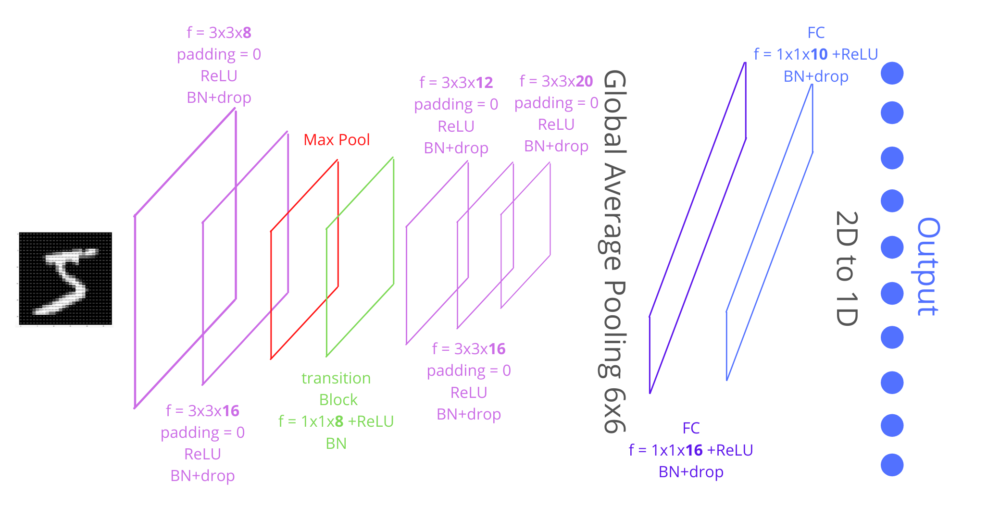
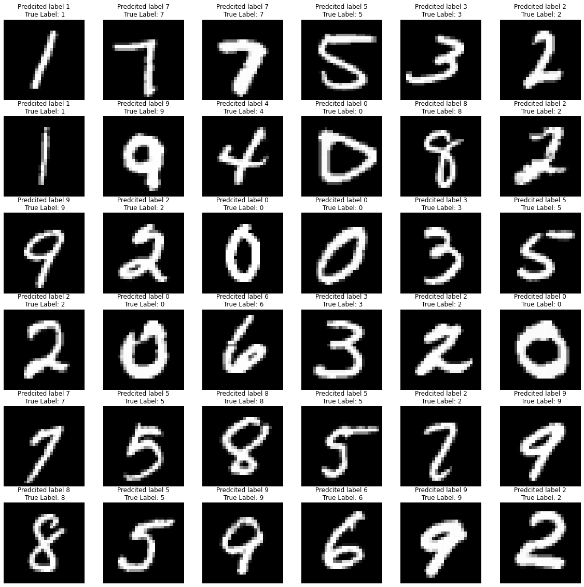

# Step-By-Step Guide to Design A Convolutional Neural Network, PyTorch

<br>

<div class="row">
  <div class="column">
    
    
    
  </div>
  <div class="column">
    
    
    
  </div>
</div>


<br>

Designing a neural network can be a complex task. There are various steps included while designing a neural network plus various regularization techniques, and it can be 
confusing to know what technique to use, where to use it and when. The number of parameters in a network depends on the dataset you are using. **Here is step-by-step approach on how to design a Convolutional Neural Network using MNIST Digit Recognizer dataset**

### Target **99.4%** Accurate on test dataset with less then **8,000** parameters

<br>

Experiment Table
----------------

<table>
  <thead>
    <tr>
      <th align="center" width="20%"=>Experiments</th>
      <th align="center" width="27%">Model Stats</th>
      <th align="center" width="53%;">Analysis</th>
    </tr>
	</thead>
	<tbody>
		<tr>
		    <td><a href="./notebooks/s7_1.ipynb" target="_blank" rel="noopener noreferrer">1: The Basic Skeleton</a></td>
			<td>
				<ul>
					<li> Total Parameters : 5.3k </li>
					<li> Training Acc : 98.56% </li>
					<li> Test Acc : 98.82% </li>
				</ul>
			</td>
			<td>
				<ul>
					<li>Designed model architeture of less than 8000 parameters The accuracy was very well with such less number of parameters</li>
					<li>Batch normalization maintained the mean and standard-deviation of activation values of layers.</li>
					<li>The best training accuracy shows the space for future training, This can be done by adding the other regulaization techniques</li>
				</ul>
			</td>
		</tr>
		<tr>
			<td><a href="./notebooks/s7_2.ipynb">2: With Data Augmentation</a></td>
			<td>
				<ul>
					<li> Total Parameters : 7.4k </li>
					<li> Training Acc : 99.01% </li>
					<li> Test Acc : 99.43% </li>
				</ul>
			</td>
			<td>
				<ul>
					<li>It Works !! but we can see 99.4 training acc in final epoch only lets push this further</li>
					<li>There were some examples in testing data on which model was not able to give correct prediction, adding data augmentation helps to modifies the training samples, which increse the performance of model while training</li>
					<li>We can see it as the jump in training accuracy and also the model is able to predict the testing data better compare with last model.</li>
				</ul>
			</td>
		</tr>
		<tr>
			<td><a href="./notebooks/s7_3.ipynb">3: Best Model with LR Schedulers</a></td>
			<td>
				<ul>
					<li> Total Parameters : 7.4k </li>
					<li> Training Acc : 99.42% </li>
					<li> Test Acc : 99.53% </li>
				</ul>
			</td>
			<td>
				<ul>
					<li>I tried different learning rate schedulers like ReduceLRPlatue which did not work because on platue decreses the learning rate when loss is incresing in a particular epochs but this did not happen in out problem. StepLR also did not work because it is hard to predict at which point the learning rate should be reduced.</li>
					<li>So, i have used OneCycleLR which updates learning rate throughout the epoch with every single batch is passed (Learning rate is updated in a particular range)</li>
					<li>accuracy of more than 99.4 in last five epochs (Form 11 to 15)</li>
				</ul>
			</td>
		</tr>
	</tbody>
</table>


Check out [here](https://paperswithcode.com/sota/image-classification-on-mnist), here the *MNIST State of the Art* results the top model *Branching/Merging CNN + Homogeneous Vector Capsules* was able to achive 99.87% accuracy with 1,514,187 Trainable Parameters and we are at  99.53% with just 7.4k parameters. NOTE: i didnt mean to compare nor stating that it is better just stating the importance of parameters while creting a network, it may be obvious that for more accuracy more parameters may be required.

# Best Model Architecture
  
<p align="center">
    
</p>

```
----------------------------------------------------------------
        Layer (type)               Output Shape         Param #
================================================================
            Conv2d-1            [-1, 8, 26, 26]              72
       BatchNorm2d-2            [-1, 8, 26, 26]              16
              ReLU-3            [-1, 8, 26, 26]               0
           Dropout-4            [-1, 8, 26, 26]               0
            Conv2d-5           [-1, 16, 24, 24]           1,152
       BatchNorm2d-6           [-1, 16, 24, 24]              32
              ReLU-7           [-1, 16, 24, 24]               0
           Dropout-8           [-1, 16, 24, 24]               0
         MaxPool2d-9           [-1, 16, 12, 12]               0
           Conv2d-10            [-1, 8, 12, 12]             128
      BatchNorm2d-11            [-1, 8, 12, 12]              16
             ReLU-12            [-1, 8, 12, 12]               0
           Conv2d-13           [-1, 12, 10, 10]             864
      BatchNorm2d-14           [-1, 12, 10, 10]              24
             ReLU-15           [-1, 12, 10, 10]               0
          Dropout-16           [-1, 12, 10, 10]               0
           Conv2d-17             [-1, 16, 8, 8]           1,728
      BatchNorm2d-18             [-1, 16, 8, 8]              32
             ReLU-19             [-1, 16, 8, 8]               0
          Dropout-20             [-1, 16, 8, 8]               0
           Conv2d-21             [-1, 20, 6, 6]           2,880
      BatchNorm2d-22             [-1, 20, 6, 6]              40
             ReLU-23             [-1, 20, 6, 6]               0
          Dropout-24             [-1, 20, 6, 6]               0
        AvgPool2d-25             [-1, 20, 1, 1]               0
           Conv2d-26             [-1, 16, 1, 1]             320
      BatchNorm2d-27             [-1, 16, 1, 1]              32
             ReLU-28             [-1, 16, 1, 1]               0
          Dropout-29             [-1, 16, 1, 1]               0
           Conv2d-30             [-1, 10, 1, 1]             160
================================================================
Total params: 7,496
Trainable params: 7,496
Non-trainable params: 0
----------------------------------------------------------------
```

Model Parameters Calculation
------------------

<p align="center">
    
</p>


| OPERATION |	N<sub>in</sub> |	N<sub>out</sub> |	CH<sub>in</sub> |	CH<sub>out</sub> |	Padding	| Kernel |	Stride	| j<sub>in</sub> |	j<sub>out</sub>	| r<sub>in</sub> |	r<sub>out</sub> |
| :-------: | :-------: | :-------: | :-------: | :-------: | :-------: | :-------: | :-------: | :-------: | :-------: | :-------: | :-------: |
| **CONVLUTION** |	28 | 26	| 1	 | 8	| 0	| 3	| 1 | 1	| 1 |	1  |  3  |
| **CONVLUTION** |	26 | 24	| 8	 | 16 |	0	| 3	| 1	| 1 |	1 |	3  |	5  |
| **MaxPool**    |	24 | 12 |	16 | 16	| 0 |	2	| 2	| 1 |	2 | 5  |	6  |
| **CONVLUTION** |	12 | 12 | 16 |	8	| 0 |	1 |	1	| 2	| 2 |	6  |	6  |
| **CONVLUTION** |	12 | 10 |	8	 | 12	| 0 | 3 |	1	| 2	| 2 |	6  |	10 |
| **CONVLUTION** |	10 | 8  |	12 | 16 | 0 | 3 |	1	| 2	| 2	| 10 |	14 |
| **CONVLUTION** |	8	 | 6  | 16 | 20	| 0	| 3	| 1	| 2 |	2	| 14 |  18 |
| **GAP**        |  6  | 1  |	20 | 20	| 0	| 6	| 1 |	2 |	2 |	18 |	28 |
| **CONVLUTION** |	1	 | 1  |	20 | 16	| 0	| 1	| 1	| 2	| 2	| 28 |  28 |
| **CONVLUTION** |	1	 | 1  |	16 | 10	| 0	| 1 |	1	| 2	| 2	| 28 |	28 |


Learning Curve
------------

<p align="center">
    
</p>

Logs
-----------

```
  Epoch 1
Train: Loss=0.1293 Batch_id=468 Accuracy=80.89: 100%|██████████| 469/469 [00:37<00:00, 12.36it/s]
Test set: Average loss: 0.1201, Accuracy: 9727/10000 (97.27%)

Epoch 2
Train: Loss=0.0514 Batch_id=468 Accuracy=96.77: 100%|██████████| 469/469 [00:38<00:00, 12.26it/s]
Test set: Average loss: 0.0631, Accuracy: 9819/10000 (98.19%)

Epoch 3
Train: Loss=0.0652 Batch_id=468 Accuracy=97.82: 100%|██████████| 469/469 [00:38<00:00, 12.28it/s]
Test set: Average loss: 0.0387, Accuracy: 9885/10000 (98.85%)

Epoch 4
Train: Loss=0.0647 Batch_id=468 Accuracy=98.18: 100%|██████████| 469/469 [00:37<00:00, 12.47it/s]
Test set: Average loss: 0.0311, Accuracy: 9897/10000 (98.97%)

Epoch 5
Train: Loss=0.0878 Batch_id=468 Accuracy=98.49: 100%|██████████| 469/469 [00:39<00:00, 11.92it/s]
Test set: Average loss: 0.0331, Accuracy: 9905/10000 (99.05%)

Epoch 6
Train: Loss=0.0864 Batch_id=468 Accuracy=98.66: 100%|██████████| 469/469 [00:38<00:00, 12.21it/s]
Test set: Average loss: 0.0274, Accuracy: 9921/10000 (99.21%)

Epoch 7
Train: Loss=0.0709 Batch_id=468 Accuracy=98.81: 100%|██████████| 469/469 [00:38<00:00, 12.18it/s]
Test set: Average loss: 0.0256, Accuracy: 9926/10000 (99.26%)

Epoch 8
Train: Loss=0.0346 Batch_id=468 Accuracy=98.85: 100%|██████████| 469/469 [00:38<00:00, 12.30it/s]
Test set: Average loss: 0.0252, Accuracy: 9922/10000 (99.22%)

Epoch 9
Train: Loss=0.0301 Batch_id=468 Accuracy=99.00: 100%|██████████| 469/469 [00:38<00:00, 12.24it/s]
Test set: Average loss: 0.0237, Accuracy: 9923/10000 (99.23%)

Epoch 10
Train: Loss=0.1060 Batch_id=468 Accuracy=99.06: 100%|██████████| 469/469 [00:38<00:00, 12.33it/s]
Test set: Average loss: 0.0220, Accuracy: 9934/10000 (99.34%)

Epoch 11
Train: Loss=0.0260 Batch_id=468 Accuracy=99.14: 100%|██████████| 469/469 [00:38<00:00, 12.29it/s]
Test set: Average loss: 0.0206, Accuracy: 9947/10000 (99.47%)

Epoch 12
Train: Loss=0.0091 Batch_id=468 Accuracy=99.22: 100%|██████████| 469/469 [00:39<00:00, 11.82it/s]
Test set: Average loss: 0.0175, Accuracy: 9950/10000 (99.50%)

Epoch 13
Train: Loss=0.0203 Batch_id=468 Accuracy=99.37: 100%|██████████| 469/469 [00:38<00:00, 12.28it/s]
Test set: Average loss: 0.0183, Accuracy: 9948/10000 (99.48%)

Epoch 14
Train: Loss=0.0071 Batch_id=468 Accuracy=99.39: 100%|██████████| 469/469 [00:38<00:00, 12.24it/s]
Test set: Average loss: 0.0171, Accuracy: 9952/10000 (99.52%)

Epoch 15
Train: Loss=0.0211 Batch_id=468 Accuracy=99.42: 100%|██████████| 469/469 [00:38<00:00, 12.22it/s]
Test set: Average loss: 0.0174, Accuracy: 9953/10000 (99.53%)

```

Evaluation of Final Model 
-----------

<p align="center">
    
</p>

